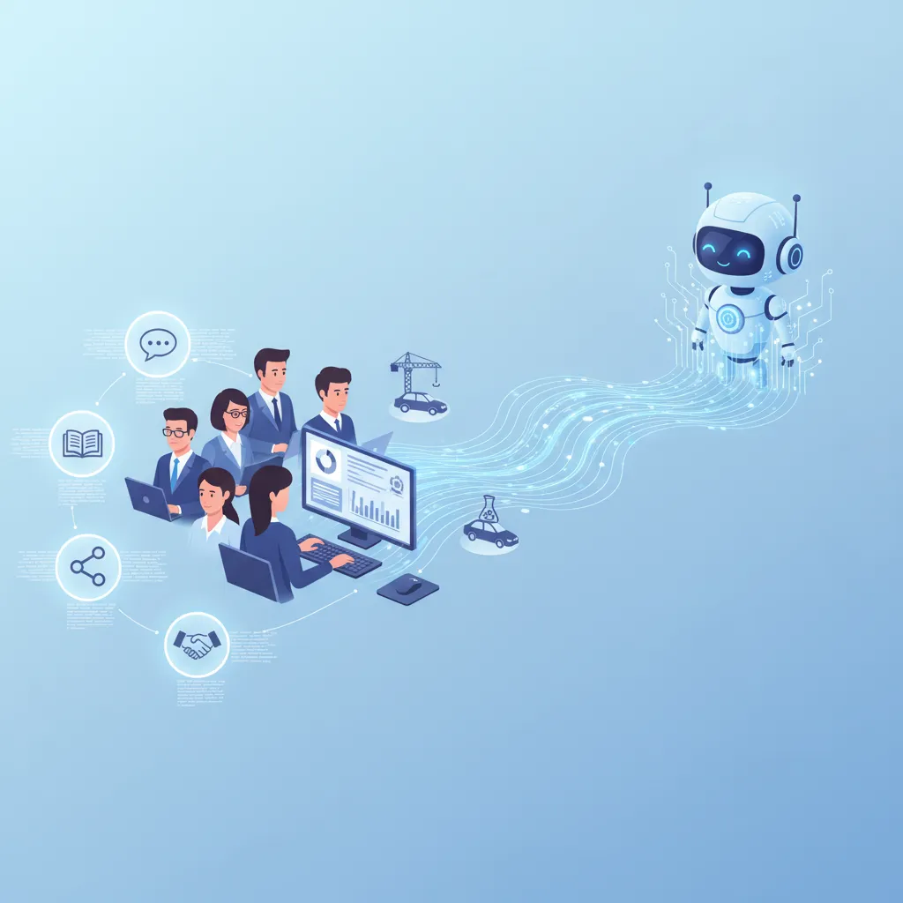

# "Transformer votre carrière avec les réseaux professionnels" 💼

**L'avenir de l'intelligence artificielle dans les réseaux sociaux professionnels** 🤖💻

Les réseaux sociaux professionnels 📈 ont révolutionné la façon dont les professionnels se connectent et échangent des informations 📚. Mais l'introduction de l'intelligence artificielle (IA) dans ces plateformes va-t-elle changer la donne ? 🤔 Dans cet article, nous aborderons les défis et les opportunités que représente l'AGI_1 (l'intelligence artificielle générale) dans les réseaux sociaux professionnels.

**Voici 5 raisons qui laissent présager un avenir excitant :**

### **1. Amélioration de la pertinence des informations 📊**

L'IA peut analyser les données de réseaux sociaux et identifier les contenus pertinents pour les utilisateurs, ce qui peut accroître la valeur de l'expérience utilisateur.

### **2. Détection de la fraude et des menaces en ligne 🚨**

L'IA peut détecter les activités suspectes et bloquer les comptes créés à des fins de spam ou de phishing.

### **3. Personalisation des contenus 📸**

L'IA peut proposer des contenus personnalisés en fonction des intérêts et des préférences des utilisateurs.

### **4. Amélioration de la sécurité des données 💻**

L'IA peut évaluer les risques d'intrusion et protéger les données des utilisateurs.

### **5. Innovation et apprentissage continu 🔮**

L'IA peut apprendre des comportements des utilisateurs et améliorer les fonctionnalités des plateformes.

**Mais il y a aussi des défis à relever :**

### **1. Confiance et transparence 🤝**

L'implication de l'IA dans les réseaux sociaux professionnels peut remettre en question la confiance mutuelle entre les utilisateurs.

### **2. Défis éthiques 🤔**

Les réseaux sociaux professionnels doivent prendre en compte les implications éthiques de l'utilisation de l'IA, notamment le risque de manipulation des informations.

### **3. Impact sur l'emploi 🚫**

La substitution de l'intelligence artificielle pourrait avoir un impact significatif sur l'emploi dans certains secteurs.

**En conclusion, l'introduction de l'AGI_1 dans les réseaux sociaux professionnels représente à la fois des opportunités et des défis. Les plateformes doivent s'appuyer sur la technologie tout en garantissant la confiance et la transparence de leurs utilisateurs. Que pensez-vous de l'avenir de l'intelligence artificielle dans les réseaux sociaux professionnels ? 🤔 Partagez vos pensées dans les commentaires ci-dessous ! 💬**

Cet article a été rédigé en HTML pour satisfaire les normes du Web sémantique W3C. J'espère que vous avez apprécié ! 💕
        