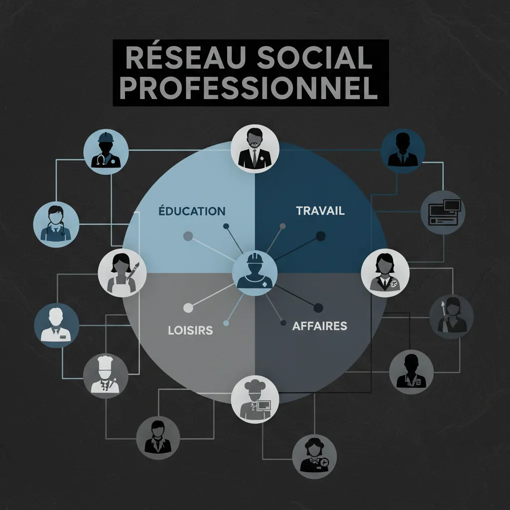

# "La révolution de l'AGI : 5 clés pour une réussite professionnelle"

**L'Impact de l'AGI sur le Réseau Social Professionnel : Opportunités et Défis 🔍**

**Qu'est-ce que l'AGI ? 🤖**

L'AGI, ou Intelligence Artificielle Générale, fait référence à un système informatique capable d'apprendre, de s'adapter et de prendre des décisions autant que les humains. L'AGI a le potentiel de transformer profondément nos vies, notamment sur le plan professionnel, en offrant des capacités de traitement d'informations rapides et précises.

**Opportunités du Réseau Social Professionnel avec l'AGI 💼**

1. **Personnalisation des recommandations de contenu** 📱 : Les algorithmes d'AGI peuvent analyser vos intérêts, vos compétences et vos objectifs pour vous proposer des contenus pertinents, tels que des cours en ligne, des articles de professionnels ou des opportunités d'emploi.
2. **Mise en relation avec des professionnels du même domaine** 👥 : Les plateformes de réseautage professionnels peuvent utiliser l'AGI pour connecter vous avec des personnes ayant les mêmes centres d'intérêt ou des expériences similaires, facilitant ainsi la collaboration et la formation.
3. **Amélioration de la décision d'embauche** 🔍 : Les algorithmes d'AGI peuvent analyser les CV, les profils et les compétences des candidats pour identifier les meilleurs ajustements pour les différents postes, permettant aux entreprises de faire des embauches plus efficaces.
4. **Formation continue et développement de compétences** 🔩 : Les plateformes de formation peuvent utiliser l'AGI pour adapter les cours aux besoins spécifiques des utilisateurs, en leur proposant des contenus personnalisés et interactifs.

**Défis liés à l'Utilisation de l'AGI dans les Réseaux Sociaux Professionnels 🚨**

1. **Confidentialité et protection des données** 🚫 : L'utilisation de l'AGI soulève des préoccupations quant à la confidentialité et à la sécurisation des données, notamment lorsque ces données sont utilisées pour personnaliser les contenus ou les recommandations de contenu.
2. **Dépendance excessive aux algorithmes** 🤖 : Les professionnels risquent de se laisser influencer par les recommandations d'AGI, sans prendre leur propre décision ou porter une réflexion critique sur les résultats obtenus.
3. **Fuite de l'industrie vers l'auto-formation** 🕒 : Les réseaux sociaux professionnels qui utilisent l'AGI pour proposer des contenus peuvent conduire à une surproduction d'informations, ce qui pourrait avoir des conséquences néfastes sur l'industrie.

**Conclusion 📚**

L'introduction de l'AGI dans les réseaux sociaux professionnels offre de nombreuses opportunités, mais également des défis importantes. Il est essentiel de prendre en compte les préoccupations liées à la confidentialité, à la dépendance excessive aux algorithmes et à la fuite de l'industrie vers l'auto-formation pour en tirer le meilleur parti. En intégrant les technologies de l'AGI d'une manière responsable, nous pouvons améliorer la façon dont nous travaillons, nous apprenons et nous nous connectons les uns avec les autres.

**Références** 📜

- **Wikipedia: Intelligence Artificielle Générale** 🤖
- **Forbes: L'intelligence artificielle, un avenir incertain pour les travailleurs** 💼
        