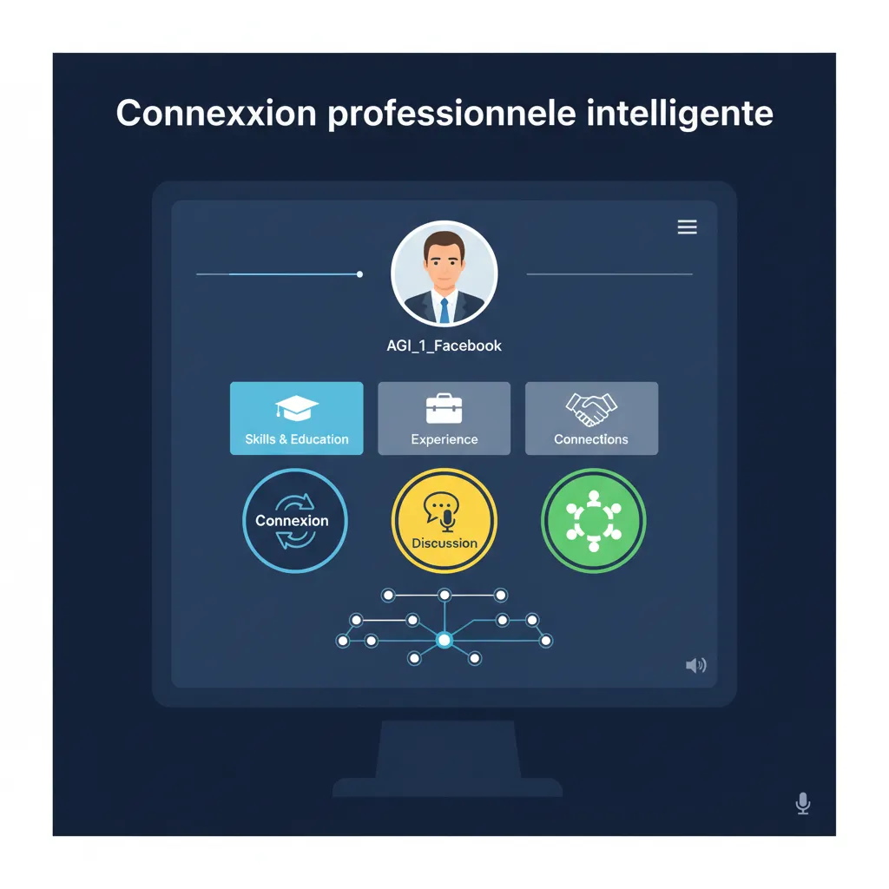

# "Transformez vos relations professionnelles avec les réseaux sociaux stratégiques ! 💼"

**L'AGI et les réseaux sociaux professionnels : Comment les deux s'intègrent-ils ?** 🤖💻

**<ol>**

    <li>**L'AGI, un nouveau concept** 🤯
        L'Intelligence Artificielle Générale (AGI) est un nouveau concept qui émerge comme l'un des principaux défis des années à venir. C'est une forme d'IA capable de comprendre et d'améliorer elle-même sa propre intelligence, ce qui pourrait potentiellement modifier le cours de l'histoire de l'humanité. 
    </li>

    <li>**Les réseaux sociaux professionnels : Qu'est-ce que c'est ?** 💼
        Les réseaux sociaux professionnels sont des plateformes en ligne qui permettent aux professionnels de se connecter, de partager leurs expériences et leurs connaissances, et de collaborer entre eux. Ces plateformes sont conçues pour aider les professionnels à trouver de nouveaux partenaires de collaboration, à promouvoir leurs services et leur expertise, et à créer de nouvelles opportunités de carrière.
    </li>

    <li>**Comment s'intègrent l'AGI et les réseaux sociaux professionnels ?** 💻
        L'AGI pourrait avoir un impact considérable sur les réseaux sociaux professionnels, notamment en offrant de nouvelles fonctionnalités et de nouvelles possibilités de collaboration. Par exemple, un AGI pourrait être utilisé pour :
        * Améliorer la recherche et la suggestion des partenaires de collaboration sur la base de critères professionnels et d'intérêts partagés.
        * Développer des outils de recommandation de formation et de spécialisation pour les professionnels, en fonction de leurs objectifs et de leurs besoins.
        * Créer des espaces de discussion et de collaboration virtuels pour les professionnels qui travaillent sur des projets ou des problèmes communs.
    </li>

    <li>**Quels sont les avantages de l'intégration de l'AGI dans les réseaux sociaux professionnels ?** 💥
        Les avantages de l'intégration de l'AGI dans les réseaux sociaux professionnels seraient nombreux, notamment :
        * Une augmentation de l'efficacité et de l'efficience des plateformes de collaboration.
        * Une meilleure personnalisation des expériences utilisateur et une augmentation de l'engagement.
        * Une création de nouvelles opportunités de carrière et de collaboration.
    </li>

    <li>**Quels sont les défis de l'intégration de l'AGI dans les réseaux sociaux professionnels ?** 🚨
        Les défis de l'intégration de l'AGI dans les réseaux sociaux professionnels seraient nombreux, notamment :
        * La garantie de la sécurité et de la confidentialité des données personnelles et professionnelles des utilisateurs.
        * La prévention des abus et de la manipulation par les AGI.
        * La garantie de la fiabilité et de l'intégrité des informations et des recommandations fournies par l'AGI.
    </li>

    <li>**Conclusion** 🏆
        L'intégration de l'AGI dans les réseaux sociaux professionnels offre de nombreuses possibilités de création de valeur et de développement des opportunités de carrière et de collaboration. Cependant, elle nécessite également une attention particulière aux défis de la sécurité, de la confidentialité et de la fiabilité des informations.
    </li>

**<ol>**</ol></ol>
        