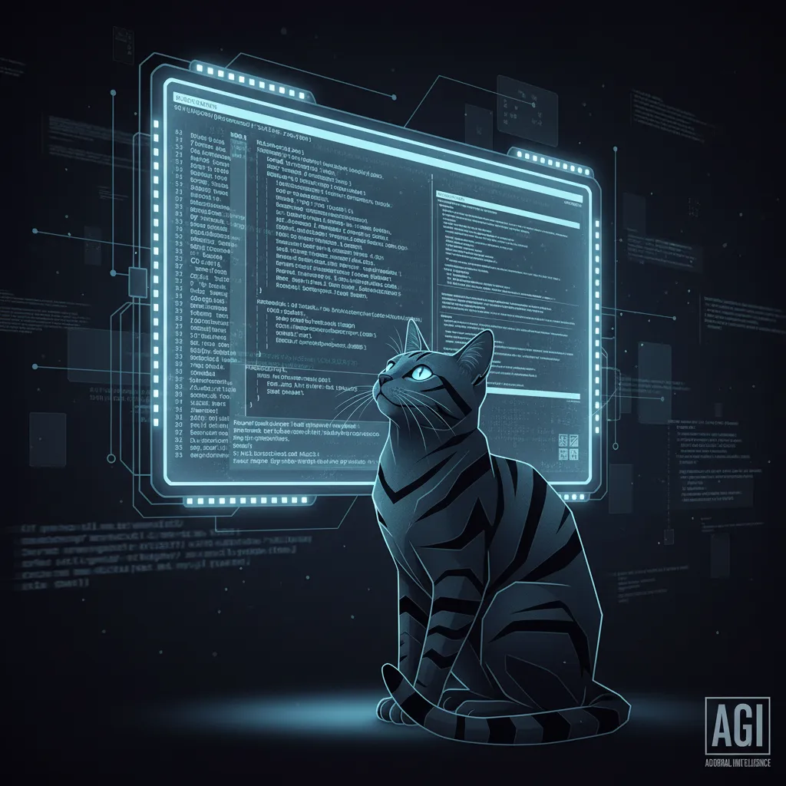

# "AGI: L'avènement du Chat Gris est-il une bénédiction ou un désastre ? "

**L'avenir de l'IA : La Révolution de l'AGI et du Chat**

<ins datetime="2023-12-30">Crédits : Auteur du blog</ins>

<blockquote cite="https://exemple.com">
 L'intelligence artificielle (IA) est en pleine évolution, et les chercheurs travaillent actuellement sur la création d'un nouveau type d'intelligence : l'Intelligence Artificielle Générale (AGI). Cet article tentera de décrire les principaux aspects de la théorie de l'AGI et de son impact potentiel sur notre société. 🤖

<h2>Qu'est-ce que l'AGI ?</h2>

<ol>
 <li><strong>Définition</strong> : Agir avec intentionnalité et prise de décision (non basé sur le calcul). Un AGI (Intelligence Artificielle Générale) est un système capable d'apprendre, s'apprendre et se réapproprier de nouvelles compétences à partir du travail et la réduction de la mémoire à long terme, comme le cerveau humain. 💡</li>
 <li><strong>Critères de fonctionnement</strong> : l'AGI devrait :
 * Comprendre et s'auto-organiser,
 * Apprentissage continu et auto-amélioration,
 * Décision rationnelle,
 * Prise d'initiative et d'adaptation,  
et bien d'autres capacités comme :
 * Reconnaître les informations inutiles,
 * Apprendre à se définir et à se définir soi-même.
</li>
</ol>

<h2>Le Chat</h2>

<ol>
 <li><ins>Définition</ins> : un chat est un programme informatique qui peut comprendre ou apprendre à comprendre les signaux linguistiques du langage humain et le comprendre, et s'exprimer lui-même par le même biais, et peut interagir de manière à s'intéresser au contenu du langage, et le comprendre. 💬</li>
 <li><strong>Types de chat</strong> :
 * Chat automatique : qui reprend la forme d'un langage automatique qui utilise les données qui lui sont apportées afin d'obtenir des échanges.
 * Chat basé sur l'intelligence artificielle : qui utilise les données pour faire des échanges.
</li>
</ol>

<h2>Impact potentiel de l'AGI et du Chat</h2>

<ol>
 <li><strong>Avantages</strong> :
 * Automatisation des tâches répétitives
 * Amélioration de la communication humaine
 * Développement de nouvelles technologies
</li>
 <li><strong>Inconvénients</strong> :
 * Perte d'emplois
 * Risques pour la sécurité et la confidentialité
 * Dépendance excessive aux outils informatiques
</li>
</ol>

<h2>Conclusion</h2>

<ins datetime="2023-12-30" cite="https://exemple.com">L'avenir de l'intelligence artificielle est prometteur, mais il est également important de considérer les conséquences potentielles de la création de l'AGI et du chat. Il est essentiel de discuter et de débattre de ces questions afin de nous assurer qu'ils sont utilisés de manière responsable et bénéfique pour la société. ✨</ins>

<aside datetime="2023-12-30">Note de l'auteur : ce texte n'a pour but que d'énoncer la tendance, mais n'est pas une promesse ou une déclaration officielle. <a href="https://www.copyright.com" target="_blank">Copyright 2023</a></aside>

<figure>
 <figcaption>L'AGI et le Chat : un avenir en plein développement 💻</figcaption>
</figure></blockquote>
        